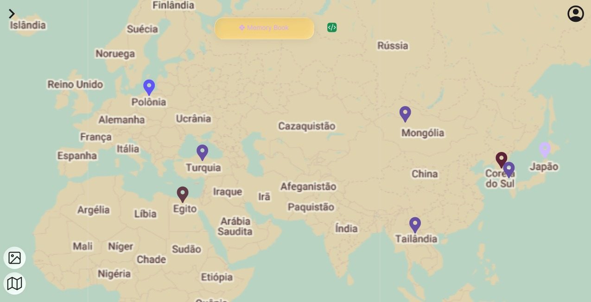
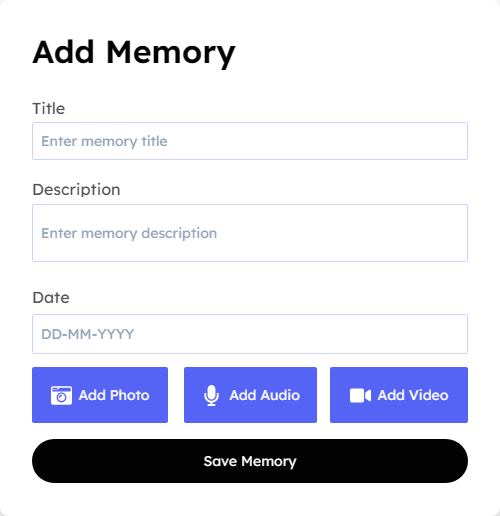
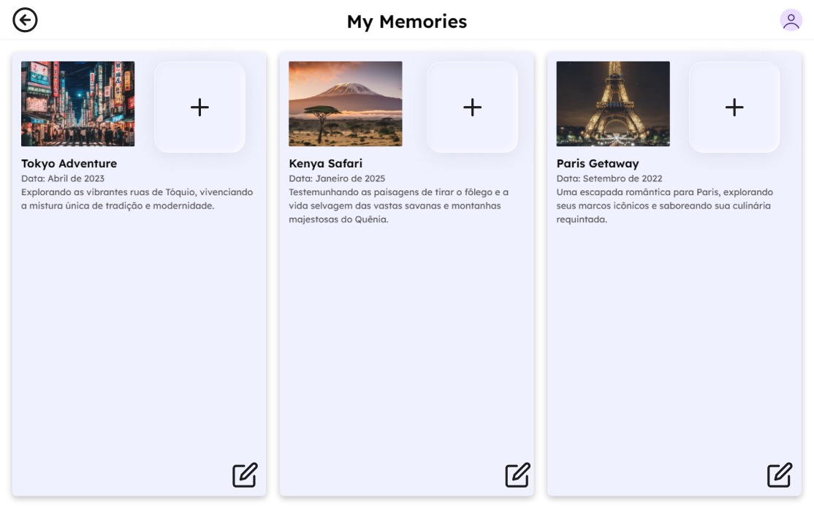

# 🗺️ Mapa de Memórias Afetivas

Um projeto desenvolvido por Alberto Pontiery, Diogo Nascimento e Guilherme Franco na matéria de Engenharia de Software que transforma lembranças em pontos interativos no mapa.  
A ideia é registrar momentos especiais (texto, fotos, áudios ou vídeos) e guardá-los em um espaço visual e afetivo. 💖  

---

## 🌟 Sobre o Projeto
O **Mapa de Memórias Afetivas** é um aplicativo web que permite:
- 📍 Marcar lugares importantes no mapa.  
- 📝 Adicionar descrições curtas das lembranças.  
- 📷 Registrar fotos, 🎤 músicas ou 🎥 vídeos.  
- 🗂️ Organizar memórias por tags, data ou humor.  
- 🤝 Compartilhar com amigos, família ou casal.  

Mais do que um CRUD, é um espaço digital poético para revisitar histórias.  
 
---

## 📌 Funcionalidades (Backlog Inicial)
- [ ] Mapa interativo base  
- [ ] Adicionar marcador manual  
- [ ] Autenticação de usuários (login/cadastro)  
- [ ] Salvar memórias no banco de dados  
- [ ] Upload de fotos e áudios  
- [ ] Visualização de memórias salvas  
- [ ] Filtros por tags/data  
- [ ] Versão colaborativa (compartilhar memórias)  

---

## 🎨 Diferenciais
- Design minimalista e acolhedor.  
- Cores diferentes para cada tipo de lembrança.  
- Animações suaves ao abrir memórias.  
- Opção de exportar sua linha do tempo como PDF.  

---
## 🏗️ Arquitetura Inicial do Projeto

```plaintext
mapa-memorias-afetivas/
│
├── backend/                  # API e regras de negócio
│   ├── server.js             # Ponto de entrada do servidor Express
│   ├── db.js                 # Conexão com o banco de dados PostgreSQL
│   ├── routes/               # Rotas da API
│   │   └── memories.js       # Rotas para CRUD de memórias
│   ├── models/               # Modelos de dados (opcional, para escalar)
│   │   └── memory.js
│   └── package.json          # Dependências do backend
│
├── frontend/                 # Interface do usuário (React + Vite)
│   ├── src/
│   │   ├── App.jsx           # Componente raiz
│   │   ├── api.js            # Configuração Axios (comunicação com backend)
│   │   ├── components/       
│   │   │   ├── MapView.jsx   # Mapa interativo (Leaflet)
│   │   │   └── MemoryForm.jsx# Formulário (futuro: adicionar fotos/áudios)
│   │   └── assets/           # Imagens, ícones, etc.
│   ├── index.html            # Página principal
│   └── package.json          # Dependências do frontend
│
├── README.md                 # Documentação do projeto
└── docker-compose.yml        # (opcional) para rodar backend + banco
```
---

## 🔄 Fluxo de Funcionamento

- Usuário -> Frontend (React + Leaflet) -> API Backend (Express) -> Banco (PostgreSQL)
  
---

## 📷 Protótipo (Preview)





---

## 🛠️ Como Rodar o Projeto
```bash
# Clone o repositório
git clone https://github.com/DiogoSNs/Memories-Book.git

# Entre na pasta
cd mapa-memorias-afetivas

# Instale as dependências
npm install

# Rode o servidor de desenvolvimento
npm run dev
