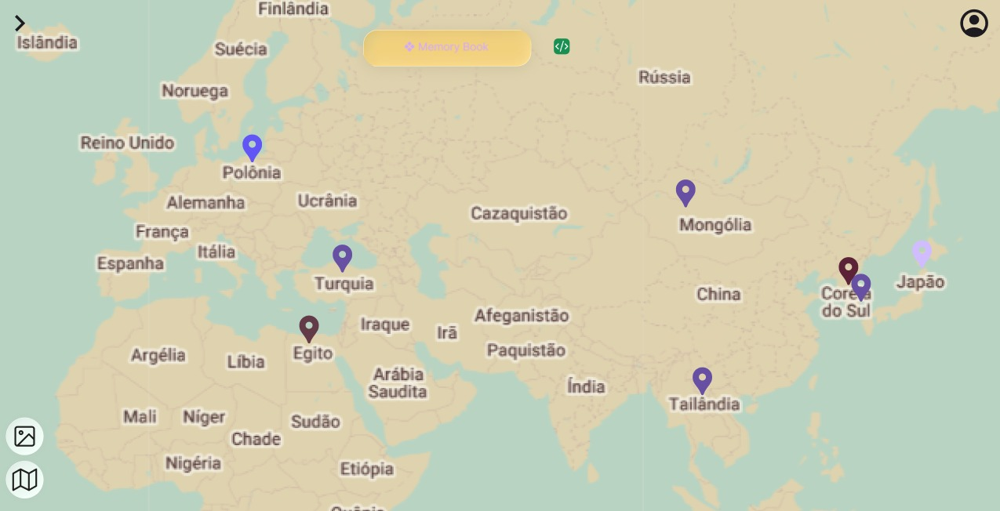
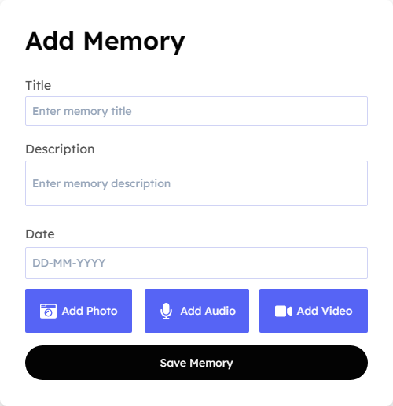
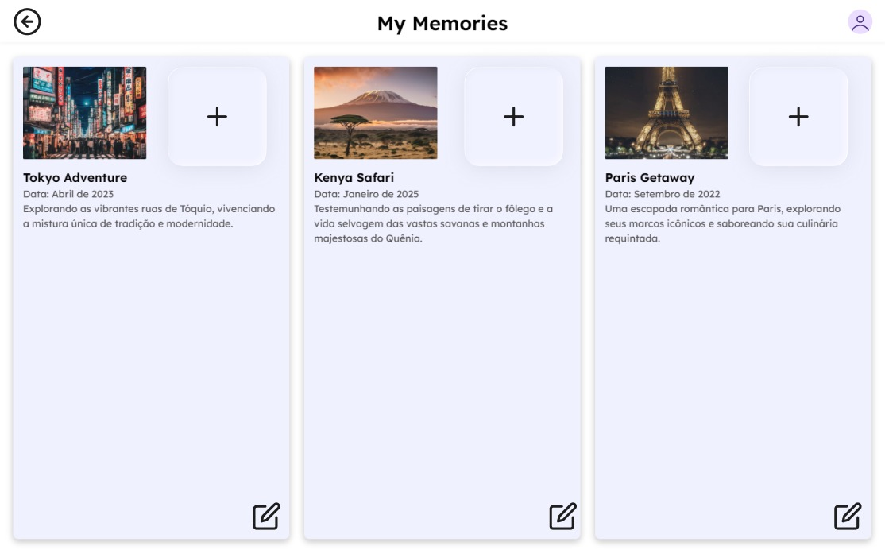

# 🗺️ Mapa de Memórias Afetivas

Um projeto desenvolvido por Alberto Pontiery, Diogo Nascimento e Guilherme Franco na matéria de Engenharia de Software que transforma lembranças em pontos interativos no mapa.  
A ideia é registrar momentos especiais (texto, fotos, áudios ou vídeos) e guardá-los em um espaço visual e afetivo. 💖  

---

## 🌟 Sobre o Projeto
O **Mapa de Memórias Afetivas** é um aplicativo web que permite:
- 📍 Marcar lugares importantes no mapa.  
- 📝 Adicionar descrições curtas das lembranças.  
- 📷 Registrar fotos, 🎤 músicas ou 🎥 vídeos.  
- 🗂️ Organizar memórias por tags, data ou humor.  
- 🤝 Compartilhar com amigos, família ou casal.  

Mais do que um CRUD, é um espaço digital poético para revisitar histórias.  
 
---

## 📌 Funcionalidades (Backlog Inicial)
- [ ] Mapa interativo base  
- [ ] Adicionar marcador manual  
- [ ] Autenticação de usuários (login/cadastro)  
- [ ] Salvar memórias no banco de dados  
- [ ] Upload de fotos e áudios  
- [ ] Visualização de memórias salvas  
- [ ] Filtros por tags/data  
- [ ] Versão colaborativa (compartilhar memórias)  

---

## 🎨 Diferenciais
- Design minimalista e acolhedor.  
- Cores diferentes para cada tipo de lembrança.  
- Animações suaves ao abrir memórias.  
- Opção de exportar sua linha do tempo.  

---

# 🧩 Proposta de Arquitetura

## Análise dos Requisitos do Projeto

O **Memory Book** é um sistema web interativo que permite aos usuários registrar lembranças pessoais em pontos geográficos, com textos e mídias associadas.  
A arquitetura precisa ser modular, escalável e preparada para futuras funcionalidades, como upload de mídias e autenticação de usuários.

### Requisitos Funcionais (RF)

| Código | Descrição |
|:-------|:-----------|
| **RF01** | Criar, visualizar, editar e excluir memórias geolocalizadas. |
| **RF02** | Exibir memórias em um mapa interativo. |
| **RF03** | Filtrar memórias por data, tag ou tipo de mídia. |
| **RF04** | Compartilhar memórias via link ou QR Code. |
| **RF05 (futuro)** | Adicionar mídias (fotos, vídeos, áudios). |

### Requisitos Não Funcionais (RNF)

| Código | Descrição |
|:-------|:-----------|
| **RNF01** | Interface responsiva e intuitiva (mobile e desktop). |
| **RNF02** | Persistência de dados em banco relacional (PostgreSQL). |
| **RNF03** | Tempo médio de resposta ≤ 3 segundos. |
| **RNF04** | Arquitetura modular e de fácil manutenção. |
| **RNF05 (futuro)** | Autenticação e controle de acesso seguro. |

### Implicações Arquiteturais

- O sistema deve manter **fronteiras claras entre frontend, backend e banco de dados**, evitando acoplamento.  
- Deve permitir **crescimento incremental**, com adição de novos módulos (upload, login).  
- Requer **API leve e responsiva** para comunicação em tempo real com o mapa.  
- A estrutura precisa facilitar **testes unitários e manutenibilidade** do código.

---

## Escolha do Padrão de Arquitetura Base

### Padrão Arquitetural Adotado

** Arquitetura Cliente-Servidor em Camadas com o padrão MVC (Model-View-Controller)**

| Critério | Decisão | Benefício |
|:----------|:--------|:----------|
| **Organização e clareza** | Uso do padrão **MVC** no backend | Facilita manutenção e entendimento do código. |
| **Escalabilidade** | Separação entre frontend e backend | Permite evolução independente de cada camada. |
| **Desempenho** | API RESTful leve (Express + JSON) | Garante comunicação rápida e flexível. |
| **Manutenibilidade** | Arquitetura em camadas (View, Controller, Model, DB) | Possibilita substituição ou melhoria de módulos sem impacto global. |
| **Segurança futura** | Middleware de autenticação | Permite implementar login e permissões (JWT). |
| **Experiência do usuário** | SPA responsiva (React + Leaflet) | Atualizações dinâmicas e fluídas sem recarregar a página. |

> Essa abordagem combina a separação de responsabilidades do **MVC** com a distribuição lógica do **cliente-servidor**, o que garante escalabilidade e organização.

### Justificativa da Escolha

A arquitetura **Cliente-Servidor em Camadas com MVC** foi escolhida porque equilibra **simplicidade e extensibilidade**.  
Ela permite o isolamento entre interface, regras de negócio e persistência de dados, o que torna o sistema mais **robusto, testável e escalável**.  

Além disso, esse padrão é amplamente recomendado para aplicações **web distribuídas**, conforme **Sommerville (2019)** e **Pressman (2016)**, pois facilita a **manutenibilidade e modularidade**, reduzindo riscos durante a evolução do software.  

> Em resumo, essa escolha garante uma base sólida para crescimento incremental — sem comprometer desempenho ou clareza estrutural.
---

## Especificação Técnica e Estrutura
### Estrutura de Diretórios

```
mapa-memorias-afetivas/
│
├── frontend/ # Camada de Apresentação (React)
│ ├── src/
│ │ ├── components/ # MapView, MemoryForm, MemoryList
│ │ ├── services/ # API.js (Axios)
│ │ └── assets/ # Ícones, imagens
│ └── package.json
│
├── backend/ # Camada de Aplicação (Node/Express)
│ ├── routes/ # Rotas REST (memories, users)
│ ├── controllers/ # Lógica de negócio
│ ├── models/ # Estrutura ORM (Sequelize)
│ ├── db.js # Conexão PostgreSQL
│ └── server.js # Inicialização da API
│
└── docker-compose.yml # Integração backend + banco
```

## Conexão da Proposta com o Projeto *Memory Book*
### Visão Geral da Arquitetura

```
┌──────────────────────────────┐
│ Apresentação                 │
│ (Frontend - React + Leaflet) │
│ - Interface SPA              │
│ - Exibição e criação de      │
│   memórias no mapa           │
└───────────────▲──────────────┘
                │
    Comunicação via API REST (JSON)
                │
┌───────────────▼──────────────┐
│ Lógica de Negócio            │
│ (Backend - Node.js / Express)│
│ - Controllers e validações   │
│ - Regras de CRUD             │
│ - Integração com banco       │
└───────────────▲──────────────┘
                │
┌───────────────▼──────────────┐
│ Persistência de Dados        │
│ (PostgreSQL + Sequelize)     │
│ - Tabelas: Usuários,         │
│   Memórias, Mídias, Tags     │
│ - Extensão PostGIS (geo)     │
└──────────────────────────────┘
```
### Relação com os Requisitos

| Requisito | Solução Arquitetural |
|:-----------|:---------------------|
| RF01–RF03 | Implementados via rotas CRUD (Express) e renderização dinâmica (React + Leaflet). |
| RF04 | Controlador gera links únicos ou QR Codes para compartilhamento. |
| RF05 | Planejado via integração com serviços externos (AWS S3 / Firebase Storage). |
| RNF01 | SPA responsiva garante compatibilidade entre dispositivos. |
| RNF02 | PostgreSQL assegura integridade e persistência de dados. |
| RNF03 | API leve com cache local e consultas otimizadas. |
| RNF04 | Separação entre camadas reduz acoplamento e facilita manutenção. |

---

## 📷 Protótipo (Preview)






---

## 🧩 Plano de Gerenciamento de Qualidade

O presente plano define os processos e padrões adotados pela equipe para assegurar a **qualidade do produto e do processo** durante o desenvolvimento do projeto **Mapa de Memórias Afetivas**.

### 👥 Papéis e Responsabilidades
| Papel | Responsável | Atribuições |
|-------|--------------|-------------|
| Integração e Qualidade | Guilherme Franco | Garante a integração entre frontend e backend, valida a comunicação entre as APIs e verifica a consistência dos dados. |
| Desenvolvedor Backend | Alberto Pontiery | Implementa API, banco de dados e rotas de comunicação. |
| Desenvolvedor Frontend | Diogo Nascimento | Cria a interface interativa e integra o frontend à API. |
| QA / Revisor | Rotativo entre os membros | Realiza testes, revisa código e valida requisitos. |

---

### 🧱 Padrões de Desenvolvimento e Ferramentas
- **Frontend:** React + Vite + Axios 
- **Backend:** Node.js + Express  
- **Banco de Dados:** PostgreSQL  
- **Controle de Versão:** Git + GitHub (branches `feature/`, `dev`, `main`)  
- **Documentação:** README + relatórios em LaTeX  
- **Gestão de Tarefas:** Trello  

Todos os membros seguem um padrão de código limpo, com boas práticas de nomeação, versionamento e comentários explicativos.  
Ferramentas auxiliares como **ESLint** e **Prettier** serão utilizadas para padronização.

---

### 🔒 Padrões Não Funcionais
- **Segurança:** evitar exposição de dados sensíveis e uso de autenticação segura.  
- **Usabilidade:** interface intuitiva, responsiva e com feedback visual claro.  
- **Desempenho:** tempo de resposta da API inferior a 3 segundos.  
- **Confiabilidade:** persistência garantida em banco de dados relacional.  

---

### ⚙️ Processos de Garantia da Qualidade
- **Gestão de atividades:** via Trello, com colunas de “A Fazer”, “Em Progresso”, “Em Revisão” e “Concluído”.  
- **Revisão de código:** outro membro deve revisar antes do merge na `main`.  
- **Validação:** uso de testes unitários e funcionais no backend.  
- **Controle de mudanças:** registro de alterações via GitHub (issues e pull requests).  
- **Revisão de documentos:** feita antes de cada entrega parcial.  

---

### 📊 Atividades e Métricas de Qualidade
| Métrica | Descrição | Meta |
|----------|------------|------|
| Taxa de sucesso dos testes | Percentual de testes que passam | ≥ 90% |
| Tempo médio de resposta | Tempo de retorno da API | ≤ 3s |
| Bugs por entrega | Erros críticos detectados antes da entrega | ≤ 2 |
| Frequência de commits | Média semanal por integrante | ≥ 3 |
| Revisões de código | Pull requests revisadas antes do merge | 100% |

---

### ✅ Critérios de Conclusão
- Todas as funcionalidades mínimas do MVP implementadas e testadas.  
- Documentação e plano de qualidade atualizados no GitHub.  
- Trello atualizado com atividades e responsáveis definidos.  
- Código funcional, comentado e validado entre os membros.  

---

## 🛠️ Como Rodar o Projeto
```bash
# Clone o repositório
git clone https://github.com/DiogoSNs/Memories-Book.git

# Entre na pasta
cd mapa-memorias-afetivas

# Instale as dependências
npm install

# Rode o servidor de desenvolvimento
npm run dev

